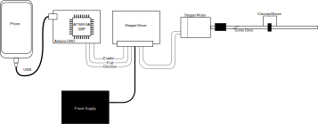

= linstep

linstep is the attempt to develop an Arduino Firmware, which allows users to command a stepper motor driven linear actuator by phone or computer.
There are alternatives like grbl, but I wanted to try this out myself.

== Repository organization

* A simulation of the chain from arduino to the camera is done in link:sim[].
* The firmware designed for Arduino Uno Boards can be found in link:firmware[].
* A cross platform desktop application is located in link:desktop-app[].
